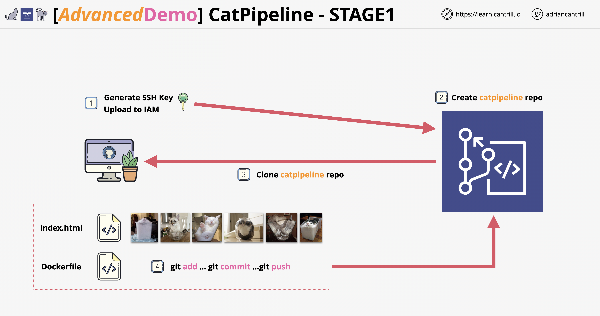

# STAGE 1 - CODE COMMIT

In this part of the advanced demo you will be creating and configuring a code commit repo as well as configuring access from your local machine.

## Generating an SSH key authenticate with codecommit

Full official instructions for Linux and macOS https://docs.aws.amazon.com/codecommit/latest/userguide/setting-up-ssh-unixes.html  

Full offical instructions for windows https://docs.aws.amazon.com/codecommit/latest/userguide/setting-up-ssh-windows.html
Run `cd ~/.ssh`
Run `ssh-keygen -t rsa -b 4096` and call the key 'codecommit', don't set any password for the key.  
Run `cat ~/.ssh/codecommit.pub` and copy the output onto your clipboard.  
In the AWS console move to the IAM console ( https://us-east-1.console.aws.amazon.com/iamv2/home?region=us-east-1#/home )  
Move to Users=>iamadmin & open that user  
Move to the `Security Credentials` tab.  
Under the AWS Codecommit section, upload an SSH key & paste in the copy of your clipboard.  
Copy down the `SSH key id` into your clipboard  

From your terminal, run `nano ~/.ssh/config` and at the top of the file add the following:

```
Host git-codecommit.*.amazonaws.com
  User KEY_ID_YOU_COPIED_ABOVE_REPLACEME
  IdentityFile ~/.ssh/codecommit
```

Change the `KEY_ID_YOU_COPIED_ABOVE_REPLACEME` placeholder to be the actual SSH key ID you copied above. 
Save the file and run a `chmod 600 ~/.ssh/config` to configure permissions correctly.  

Test with `ssh git-codecommit.us-east-1.amazonaws.com` and if successful it should show something like this.  

```
You have successfully authenticated over SSH. You can use Git to interact with AWS CodeCommit. Interactive shells are not supported.Connection to git-codecommit.us-east-1.amazonaws.com closed by remote host.
```

## Creating the code commit repo for cat pipeline

Move to the code commit console (https://us-east-1.console.aws.amazon.com/codesuite/codecommit/repositories?region=us-east-1)  
Create a repository.  
Call it `catpipeline-codecommit-XXX` where XXX is some unique numbers.  
Once created, locate the connection steps details and click `SSH`  
Locate the instructions for your specific operating system.  
Locate the command for `Clone the repository` and copy it into your clipboard.  
In your terminal, move to the folder where you want the repo stored. Generally i create a `repos` folder in my home folder using the `mkdir ~/repos` command, then move into this folder with `cd ~/repos`  
then run the clone command, which should look something like `ssh://git-codecommit.us-east-1.amazonaws.com/v1/repos/catpipeline-codecommit-XXX`  

## Adding the demo code

Download this file https://github.com/acantril/learn-cantrill-io-labs/raw/master/aws-codepipeline-catpipeline/01_LABSETUP/container.zip  
Copy the ZIP into the repo folder you created in the previous step.  
Extract the zip file into that folder.  
Delete the zip file  

then from the terminal move into that folder  
Run these commands.  

``` 
git add -A . 
git commit -m “container of cats” 
git push 

```

Ok so now you have a codecommit repo, with some code and are ready to move to the next step. Before proceeding to the next step you should be familiar with the Elastic Container Repo, we will be using this to store a docker image which we create from this source.

