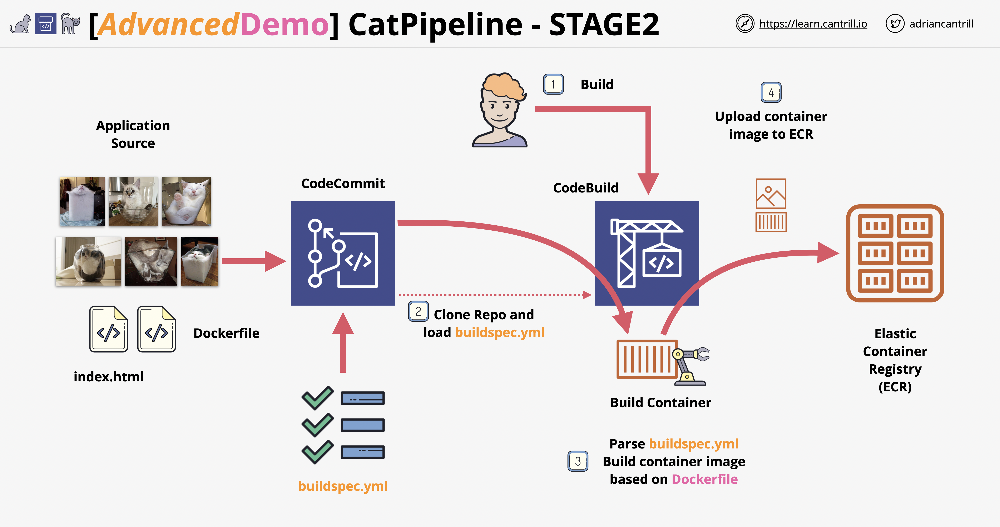
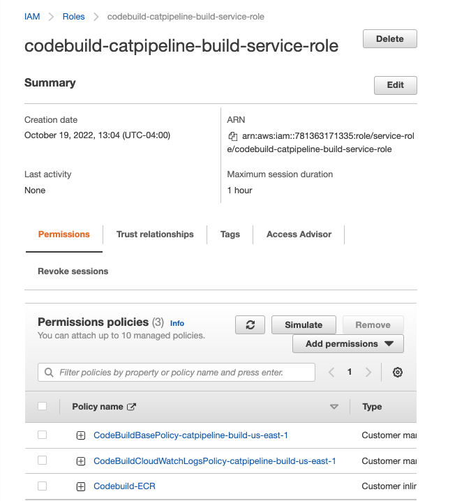
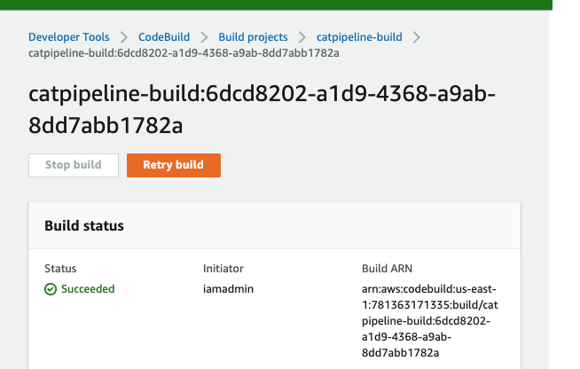
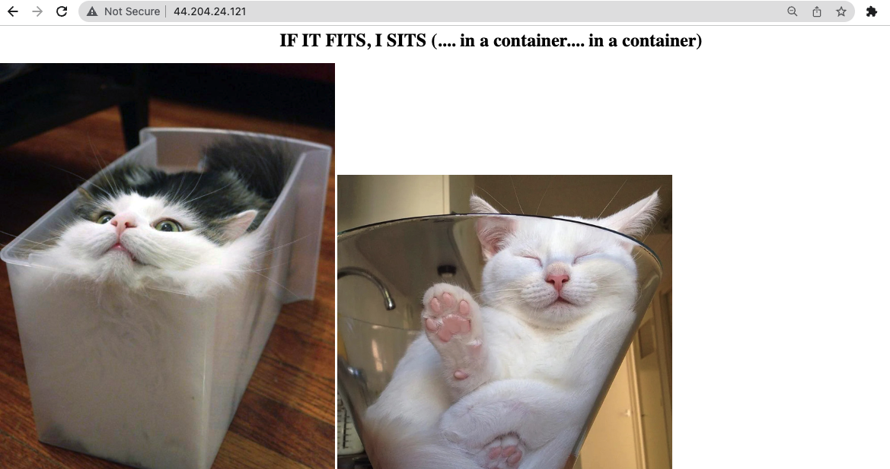

# STAGE 2 - CODE BUILD

Welcome to stage 2 of this demo where you will configure the Elastic Container Registry and use the codebuild service to build a docker container and push it into this registry.

## CREATE A PRIVATE REPOSITORY

Move to the Container Services console, the repositories (https://us-east-1.console.aws.amazon.com/ecr/repositories?region=us-east-1)  
Create a Repository.  
It should be a private repository.  
..and for the alias/name pick 'catpipeline'.  
Note down the URL and name (it should match the above name). 

This is the repository that codebuild will store the docker image in, created from the codecommit repo.   

## SETUP A CODEBUILD PROJECT

Next, we will configure a codebuild project to take what's in the codecommit repo, build a docker image & store it within ECR in the above repository.

Move to the codebuild console (https://us-east-1.console.aws.amazon.com/codesuite/codebuild/projects?region=us-east-1)  

Create code build project
  
### PROJECT CONFIGURATION
For `Project name` put `catpipeline-build`.  
Leave all other options in this section as default.  

### SOURCE
For `Source Provider` choose `AWS CodeCommit`  
For `Repository` choose the repo you created in stage 1  
Check the `Branch` checkbox and pick the branch from the `Branch` dropdown (there should only be one).  

### ENVIRONMENT
for `Environment image` pick `Managed Image`  
Under `Operating system` pick `Amazon Linux 2`  
under `Runtime(s)` pick `Standard`
under `Image` pick `aws/codebuild/amazonlinux2-x86_64-standard:X.0` where X is the highest number.  
Under `Image version` `Always use the latest image for this runtime version`  
Under `Envrironment Type` pick `Linux`  
Check the `Privileged` box (Because we're creating a docker image)  
For `Service role` pick `New Service Role` and leave the default suggested name which should be something like `codebuild-catpipeline-service-role`  
Expand `Additional Configuration`  
We're going to be adding some environment variables

Add the following:-

```
AWS_DEFAULT_REGION with a value of us-east-1
AWS_ACCOUNT_ID with a value of your AWS_ACCOUNT_ID_REPLACEME
IMAGE_TAG with a value of latest
IMAGE_REPO_NAME with a value of your ECR_REPO_NAME_REPLACEME
```

### BUILDSPEC
The buildspec.yml file is what tells codebuild how to build your code.. the steps involved, what things the build needs, any testing and what to do with the output (artifacts).

A build project can have build commands included... or, you can point it at a buildspec.yml file, i.e one which is hosted on the same repository as the code.. and that's what you're going to do.  

Check `Use a buildspec file`  
you don't need to enter a name as it will use by default buildspec.yml in the root of the repo. If you want to use a different name, or have the file located elsewhere (i.e in a folder) you need to specify this here.  

### ARTIFACTS
No changes to this section, as we're building a docker image and have no testing yet, this part isn't needed.

### LOGS

This is where the logging is configured, to Cloudwatch logs or S3 (optional).  

For `Groupname` enter `a4l-codebuild`  
and for `Stream Name` enter `catpipeline`  

Create the build Project

## BUILD SECURITY AND PERMISSIONS

Our build project will be accessing ECR to store the resultant docker image, and we need to ensure it has the permissons to do that. The build process will use an IAM role created by codebuild, so we need to update that roles permissions with ALLOWS for ECR.  

Go to the IAM Console (https://us-east-1.console.aws.amazon.com/iamv2/home#/home)  
Then Roles  
Locate and click the codebuild cat pipeline role i.e. `codebuild-catpipeline-build-service-role`  
Click the `Permissions` tab and we need to Add a permission and it will be an `inline policy`  
Select to edit the raw `JSON` and delete the skeleton JSON, replacing it with

```
{
  "Statement": [
	{
	  "Action": [
		"ecr:BatchCheckLayerAvailability",
		"ecr:CompleteLayerUpload",
		"ecr:GetAuthorizationToken",
		"ecr:InitiateLayerUpload",
		"ecr:PutImage",
		"ecr:UploadLayerPart"
	  ],
	  "Resource": "*",
	  "Effect": "Allow"
	}
  ],
  "Version": "2012-10-17"
}
```

Move on and review the policy.  
Name it `Codebuild-ECR` and create the policy
This means codebuild can now access ECR.  

## BUILDSPEC.YML

Create a file in the local copy of the `catpipeline-codecommit-XXX` repo called `buildspec.yml`  
Into this file add the following contents :-  

```
version: 0.2

phases:
  pre_build:
	commands:
	  - echo Logging in to Amazon ECR...
	  - aws ecr get-login-password --region $AWS_DEFAULT_REGION | docker login --username AWS --password-stdin $AWS_ACCOUNT_ID.dkr.ecr.$AWS_DEFAULT_REGION.amazonaws.com
  build:
	commands:
	  - echo Build started on `date`
	  - echo Building the Docker image...          
	  - docker build -t $IMAGE_REPO_NAME:$IMAGE_TAG .
	  - docker tag $IMAGE_REPO_NAME:$IMAGE_TAG $AWS_ACCOUNT_ID.dkr.ecr.$AWS_DEFAULT_REGION.amazonaws.com/$IMAGE_REPO_NAME:$IMAGE_TAG      
  post_build:
	commands:
	  - echo Build completed on `date`
	  - echo Pushing the Docker image...
	  - docker push $AWS_ACCOUNT_ID.dkr.ecr.$AWS_DEFAULT_REGION.amazonaws.com/$IMAGE_REPO_NAME:$IMAGE_TAG
```

Then add this locally, commit and stage

``` 
git add -A .
git commit -m “add buildspec.yml”
git push 
```

## TEST THE CODEBUILD PROJECT

Open the CodeBuild console (https://us-east-1.console.aws.amazon.com/codesuite/codebuild/projects?region=us-east-1)  
Open `catpipeline-build`  
Start Build  
Check progress under phase details tab and build logs tab  

## TEST THE DOCKER IMAGE

Use this link to deploy an EC2 instance with docker installed (https://console.aws.amazon.com/cloudformation/home?region=us-east-1#/stacks/quickcreate?templateURL=https://learn-cantrill-labs.s3.amazonaws.com/aws-codepipeline-catpipeline/ec2docker.yaml&stackName=DOCKER) accept all details, check the checkbox and create the stack.
Wait for this to move into the `CREATE_COMPLETE` state before continuing.  

Move to the EC2 Console ( https://us-east-1.console.aws.amazon.com/ec2/home?region=us-east-1#Home: )  
Instances  
Select `A4L-PublicEC2`, right click, connect  
Choose EC2 Instance Connect, leave everything with defaults and connect.  


Docker should already be preinstalled and the EC2 instance has a role which gives ECR permissions which you will need for the next step.

test docker via  `docker ps` command
it should output an empty list  


run a `aws ecr get-login-password --region us-east-1`, this command gives us login information for ECR which can be used with the docker command. To use it use this command.

you will need to replace the placeholder with your AWS Account ID (with no dashes)

`aws ecr get-login-password --region us-east-1 | docker login --username AWS --password-stdin ACCOUNTID_REPLACEME.dkr.ecr.us-east-1.amazonaws.com`

Go to the ECR console (https://us-east-1.console.aws.amazon.com/ecr/repositories?region=us-east-1)  
Repositories  
Click the `catpipeline` repository  
For `latest` copy the URL into your clipboard  

run the command below pasting in your clipboard after docker p
`docker pull ` but paste in your clipboard after the space, i.e 
`docker pull ACCOUNTID_REPLACEME.dkr.ecr.us-east-1.amazonaws.com/catpipeline:latest` (this is an example, you will need your image URI)  

run `docker images` and copy the image ID into your clipboard for the `catpipeline` docker image

run the following command replacing the placeholder with the image ID you copied above.  

`docker run -p 80:80 IMAGEID_REPLACEME`

Move back to the EC2 console tab  
Click `Instances` and get the public IPv4 address for the A4L-PublicEC2 instance.  
open that IP in a new tab, ensuring it's http://IP not https://IP  
You should see the docker container running, with cats in containers... if so, this means your automated build process is working. 
 


