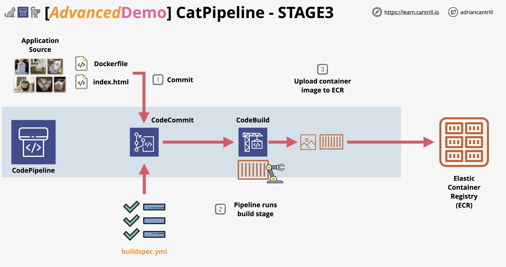
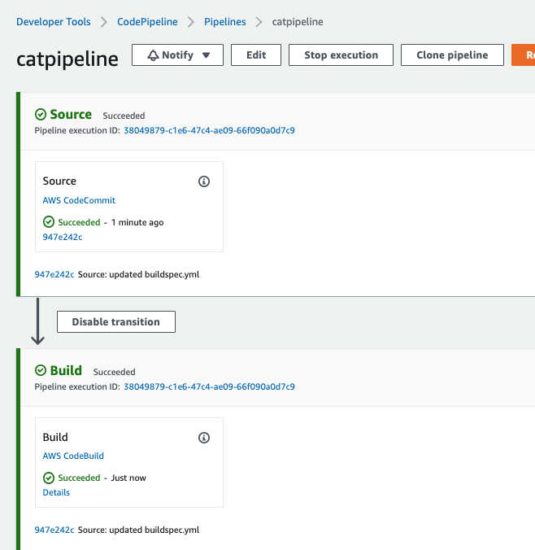
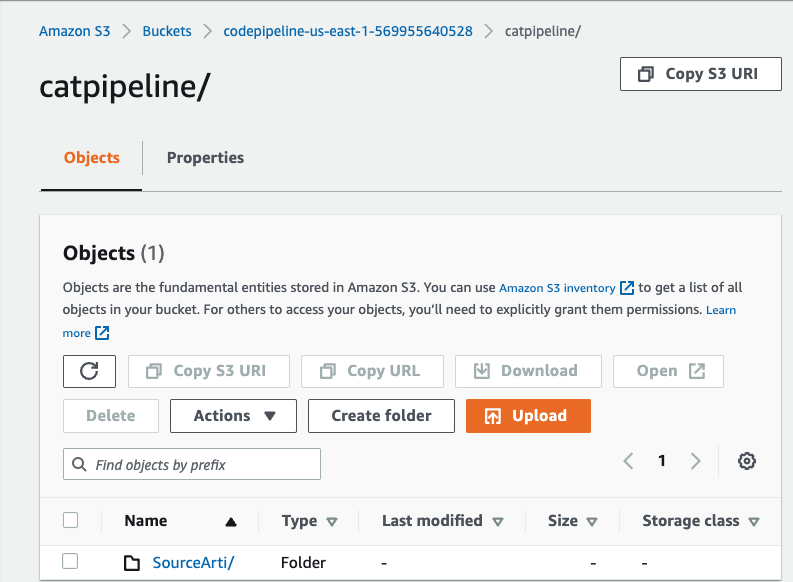
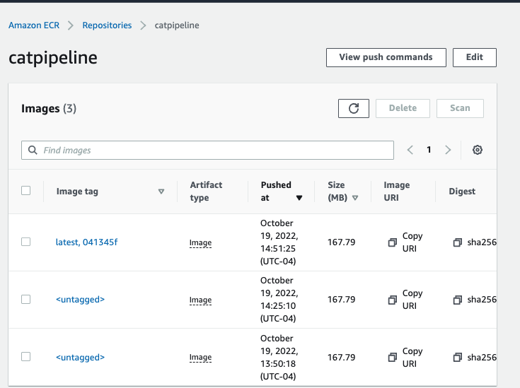

# STAGE 3 - CODE PIPELINE

In this stage of the demo you will create a code pipeline which will utilise CODECOMMIT and CODEBUILD to create a continous build process. The aim is that every time a new commit is made to the comecommit repo, a new docker image is created and pushed to ECR. Initially you will be skipping the codedeploy step which will be added next.



## PIPELINE CREATION

Move to the codepipeline console (https://us-east-1.console.aws.amazon.com/codesuite/codepipeline/pipelines)  
Create a pipeline  
For `Pipeline name` put `catpipeline`.  
Chose to create a `new service role` and keep the default name, it should be called `AWSCodePipelineServiceRole-us-east-1-catpipeline` 
Expand `Advanced Settings` and make sure that `default location` is set for the artifact store and `default AWS managed key` is set for the `Encryption key`  
Move on

### Source Stage

Pick `AWS CodeCommit` for the `Source Provider`  
Pick `catpipeline-codecommit` for the report name
Select the branch from the `Branch name` dropdown
From `Detection options` pick `Amazon CloudWatch Events` and for `Output artifact format` pick `CodePipeline default`  
Move on

### Build Stage

Pick `AWS CodeBuild` for the `Build provider`  
Pick `US East (N.Virginia)` for the `Region`  
Choose the project you created earlier in the `Project name` search box  
For `Build type` choose `Single Build`
Move on

### Deploy Stage

Skip deploy Stage, and confirm  
Create the pipeline

## PIPELINE TESTS
The pipeline will do an initial execution and it should complete without any issues.  
You can click details in the build stage to see the progress...or wait for it to complete  

Open the S3 console in a new tab (https://s3.console.aws.amazon.com/s3/) and open the `codepipeline-us-east-1-XXXX` bucket  
Click `catpipeline/`  
This is the artifacts area for this pipeline, leave this tab open you will be using in later in the demo.  

## UPDATE THE BUILD STAGE

Find your local copy of the catpipeline-codecommit repo and update the buildspec.yml file as below

```
version: 0.2

phases:
  pre_build:
	commands:
	  - echo Logging in to Amazon ECR...
	  - aws ecr get-login-password --region $AWS_DEFAULT_REGION | docker login --username AWS --password-stdin $AWS_ACCOUNT_ID.dkr.ecr.$AWS_DEFAULT_REGION.amazonaws.com
	  - REPOSITORY_URI=$AWS_ACCOUNT_ID.dkr.ecr.$AWS_DEFAULT_REGION.amazonaws.com/$IMAGE_REPO_NAME
	  - COMMIT_HASH=$(echo $CODEBUILD_RESOLVED_SOURCE_VERSION | cut -c 1-7)
	  - IMAGE_TAG=${COMMIT_HASH:=latest}
  build:
	commands:
	  - echo Build started on `date`
	  - echo Building the Docker image...          
	  - docker build -t $REPOSITORY_URI:latest .
	  - docker tag $REPOSITORY_URI:latest $REPOSITORY_URI:$IMAGE_TAG    
  post_build:
	commands:
	  - echo Build completed on `date`
	  - echo Pushing the Docker image...
	  - docker push $REPOSITORY_URI:latest
	  - docker push $REPOSITORY_URI:$IMAGE_TAG
	  - echo Writing image definitions file...
	  - printf '[{"name":"%s","imageUri":"%s"}]' "$IMAGE_REPO_NAME" "$REPOSITORY_URI:$IMAGE_TAG" > imagedefinitions.json
artifacts:
  files: imagedefinitions.json
```

## TEST A COMMIT

run

```
git add -A .
git commit -m "updated buildspec.yml"
git push
```

Watch the pipeline run, and generate a new version of the image in ECR automatically when the commit happens.



