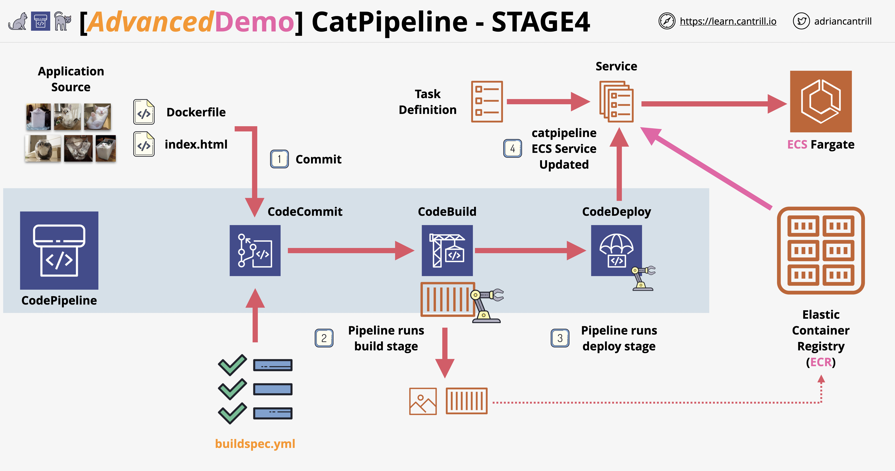
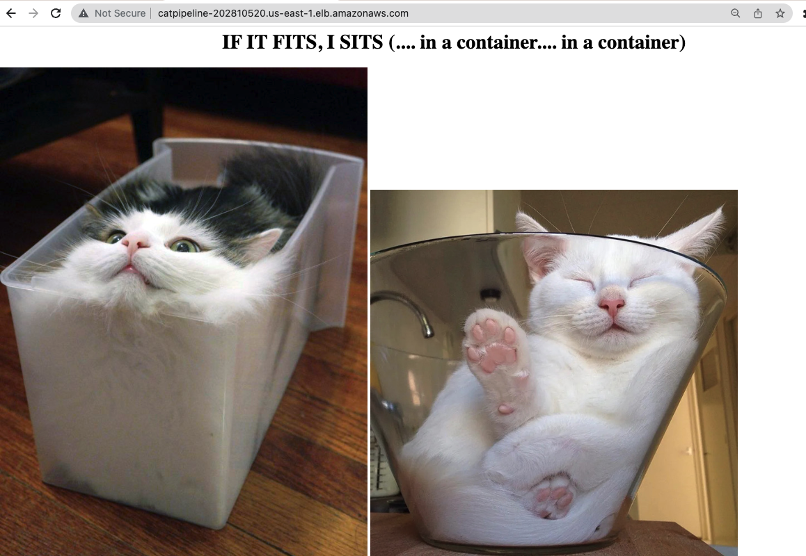
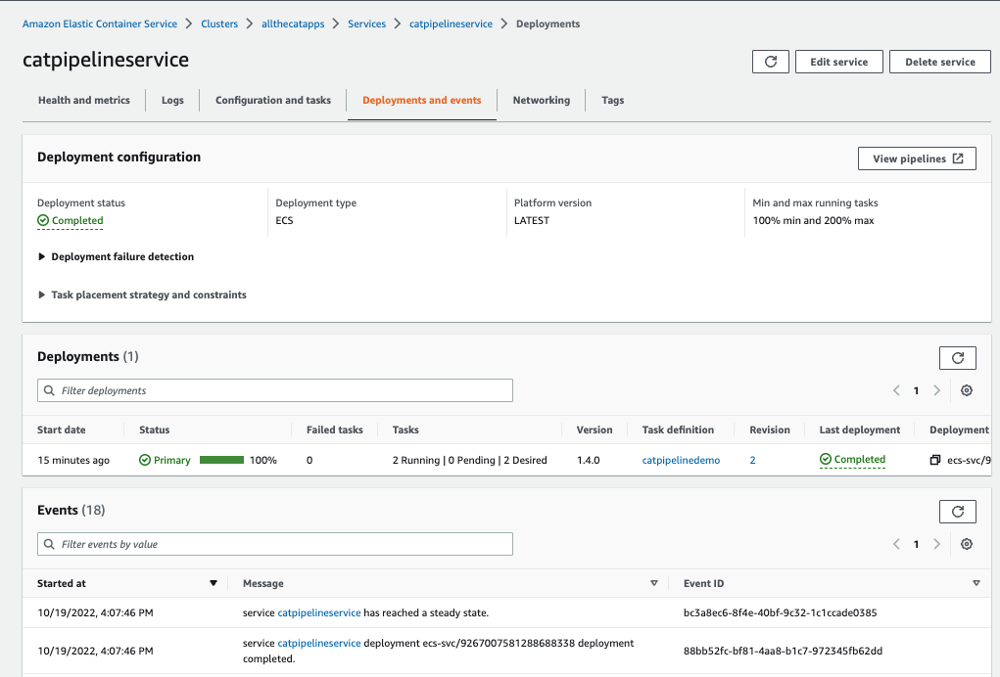
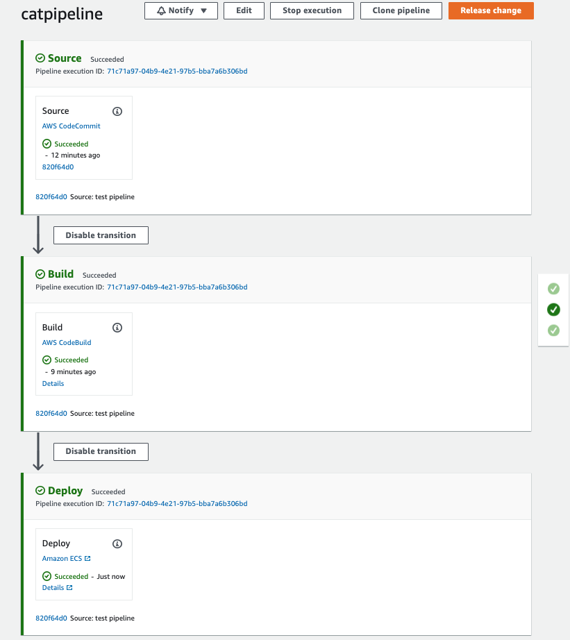
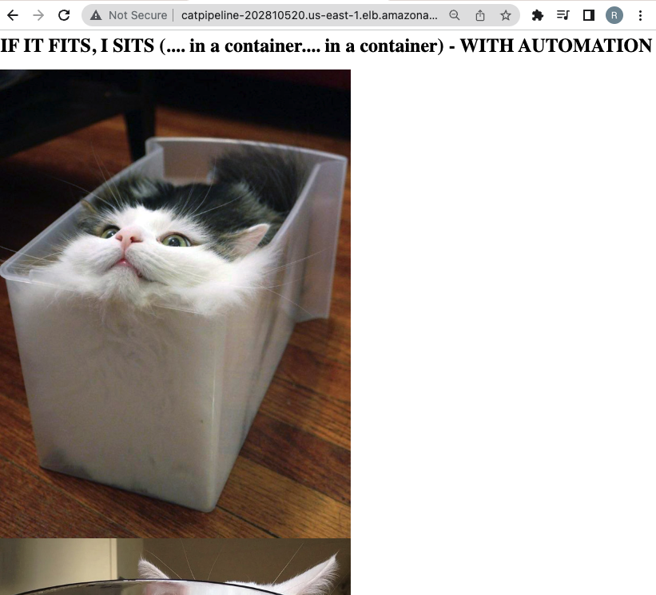

# STAGE 4 - CODE DEPLOY

In this stage, you will configure automated deployment of the cat pipeline application to ECS Fargate



## Configure a load balancer

First, you're going to create a load balancer which will be the entry point for the containerised application

Go to the EC2 Console (https://us-east-1.console.aws.amazon.com/ec2/v2/home?region=us-east-1#Home:) then Load Balancing -> Load Balancers -> Create Load Balancer.  
Create an application load balancer.  
Call it `catpipeline`  
Internet Facing
IPv4
For network, select your default VPC and pick ALL subnets in the VPC.  
Create a new security group (this will open a new tab)
Call it `catpipeline-SG` and put the same for description
Delect the default VPC in the list
Add an inbound rule, select HTTP and for the source IP address choose 0.0.0.0/0
Create the security group.  

Return to the original tab, click the refresh icon next to the security group dropdown, and select `catpinepine-SG from the list` and remove the default security group.  

Under `listners and routing` make sure HTTP:80 is configured for the listner.  
Create a target group, this will open a new tab
call it `catpipelineA-TG`, ensure that `IP`, HTTP:80, HTTP1 and the default VPC are selected.  
Click next and then create the target group, for now we wont register any targets.  
Return to the original tab, hit the refresh icon next to target group and pick `catpipelineA-TG` from the list.  
Then create the load balancer. 
This will take a few minutes to create, but you can continue on with the next part while this is creatign.


## Configure a Fargate cluster

Move to the ECS console (https://us-east-1.console.aws.amazon.com/ecs/home?region=us-east-1#/getStarted)
Clusters, Create a Cluster and it needs to be `Networking Only` (this will be using fargate)  
Move on, and name the cluster `allthecatapps`
We will be using the default VPC so there is no need to create one (don't check the box)
Create the cluster. **if you get a error at this point, it may be the first time you are using ECS and thats ok** exit the creation process and then rerun it. There is service activation happening behind the scenes when you first use it, and it can prevent you creating a cluster. exiting and retrying solves 99% of these issues, for the 1% wait 10 minutes and then repeat.


## Create Task and Container Definitions

Go to the ECS Cluster (https://us-east-1.console.aws.amazon.com/ecs/home?region=us-east-1#/clusters)  
Move to `Task Definitions` and create a task definition.  
Select Fargate and move on.  
Call it `catpipelinedemo` and for `operating system family` put `Linux`  
Select `ecsTaskExecutionRole` under task role.  
Pick `1GB` for task member and `0.5vCPU` for task CPU.  
Add Container
Container name `catpipeline`
For image put the URL to your image in ECR
	to get this, move to ECR console, repositories, click your repo, then click `Copy URI`
Add a port mapping `80` `tcp`
Add the container.
Create (_if you get an error here, click back and then create again_)  
View Task Definition & Click `JSON`, copy the json down somewhere as the `task definition json`  


## DEPLOY TO ECS - CREATE A SERVICE
Click Actions, Create Service.
for `Launch type` pick `FARGATE`
for `Service Name` pick `catpipelineservice`  
for `Number of tasks` pick 2
for `Deployment type` pick `rolling update`
Next Step
for `Cluster VPC*` pick the default VPC
for `Subnets` select all subnets in the default VPC
for `Auto-Assign public IP` choose `ENABLED`  
for `Load Balancer Type` pick `Application Load Balancer`
for `Load balancer name` pick `catpipeline`  
for `container to load balance` select 'catpipeline:80:80' and click `Add to load balancer`
for `Production listener port` select `80:HTTP` from the dropdown
for `Target group name` pick `catpipelineA-TG`  
Next
Next
Create Service
View Service

The service is now running with the :latest version of the container on ECR, this was done using a manual deployment

## TEST

Move to the load balancer console (https://us-east-1.console.aws.amazon.com/ec2/v2/home?region=us-east-1#LoadBalancers)  
Pick the `catpipeline` load balancer  
Copy the `DNS name` into your clipboard  
Open it in a browser, ensuring it is using http:// not https://  
You should see the container of cats website - if it fits, i sits



## ADD A DEPLOY STAGE TO THE PIPELINE

Move to the code pineline console (https://us-east-1.console.aws.amazon.com/codesuite/codepipeline/pipelines?region=us-east-1)
Click `catpipeline` then `edit`
Click `+ Add Stage`  
Call it `Deploy` then Add stage  
Click `+ Add Action Group`  
for `Action name` put `Deploy`  
for `Action Provider` put `Amazon ECS`  
for `Region` pick `US East (N.Virginia)`  
for `Input artifacts` select `Build Artifact`  (this will be the `imagedefinitions.json` info about the container)  
for `Cluster Name` pick `allthecatapps`  
for `Service Name` pick `catpipelineservice`  
for `Image Definitions file` put `imagedefinitions.json`  
Click Done
Click Save & Confirm

## TEST

in the local repo `catpipeline-codecommit` add `- WITH AUTOMATION` to the inside of h1 tag in index.html  
then run

```
git add -A .
git commit -m "test pipeline"
git push
```
 
watch the code pipeline console (https://us-east-1.console.aws.amazon.com/codesuite/codepipeline/pipelines/catpipeline/view?region=us-east-1)

make sure each pipeline step completes

New image is running with ECS cluster



